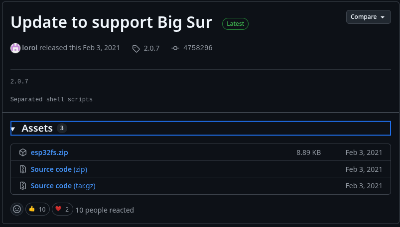

## prueba Guia instalacion

pasos 
placa duit esp32  utiliza el procesor esp32 

explicar primero el esp32
detalles de memoria y memoria externa 

explicar el display 
explicar el controlador y la interfaz de conexion xpt etc

tarjeta micro sd con sistema de archivos fat 32

componentes opcionales 
 un modulo gps 
 sensibilidad y modelo y frecuencia de actualizacion
 
 led pixcel

 EXPLICAL LA CONEXION O CABLEADO (DIAGRAMA ESQUEMATICO)

Instalar arduino Ide version :

 INSTALAR HERRAMIENTAS Y LIBRERIAS 

ingresar al directorio raiz de Arduino Ide
 
 creamos los directorio
 
 mkdir tools cd tools
 mkdir ESP32FS cd ESP32FS

 decargamos el archivo  esp32fs.zip del sigueinte repositorio:
 https://github.com/lorol/arduino-esp32fs-plugin/releases

 

 ACTUALIZADA

LUEGO SELECCIONAMOS HERRAMIENTAS PLACA
GESTOR DE TAJETAS
Y BUSCAMOS ESP32 BY ESPRESIFT SINDORME INSTALAMOS 
VERISON 2.0.14

INSTALAR LIBRERIAS

LinkedList — https://github.com/ivanseidel/LinkedList

TFT_eSPI (fork de justcallmekoko) — https://github.com/justcallmekoko/TFT_eSPI

JPEGDecoder — https://github.com/Bodmer/JPEGDecoder

NimBLE-Arduino — https://github.com/h2zero/NimBLE-Arduino

Adafruit NeoPixel — https://github.com/adafruit/Adafruit_NeoPixel

ArduinoJson v6.18.2 — https://github.com/bblanchon/ArduinoJson/releases/tag/v6.18.2

SwitchLib — https://github.com/justcallmekoko/SwitchLib

ESPAsyncWebServer — https://github.com/ESP32Async/ESPAsyncWebServer

AsyncTCP — https://github.com/ESP32Async/AsyncTCP

ESP32Ping — https://github.com/marian-craciunescu/ESP32Ping

MicroNMEA — https://github.com/stevemarple/MicroNMEA

XPT2046_Touchscreen — https://github.com/PaulStoffregen/XPT2046_Touchscreen

EspSoftwareSerial v6.17.1 — https://github.com/plerup/espsoftwareserial/releases/tag/6.17.1

Adafruit BusIO — https://github.com/adafruit/Adafruit_BusIO

Adafruit MAX1704X — https://github.com/adafruit/Adafruit_MAX1704X

repositorio oficial del proyecto marauder
https://github.com/justcallmekoko/ESP32Marauder

descargar y eliminar las carpetas build y data

AGREGAMO EL NUCLEO ESP32 ANUESTRA PLACA DESDE EL SIGUEINTE URL 
https://docs.espressif.com/projects/arduino-esp32/en/latest/installing.html

 AGREGAMOS EL LINK ESTABLE
 https://espressif.github.io/arduino-esp32/package_esp32_index.json

 se debe agregar en gestor de targetas esp32
 se debe seleccionar la version 2.0.17

modificar platform

ingresar a la ruta :

sudo nano ~/.arduino15/packages/esp32/hardware/esp32/2.0.17/platform.txt

agregamos -w
a
build.extra_flags.esp32
deberia quedar:
build.extra_flags.esp32=-DARDUINO_USB_CDC_ON_BOOT=0 -w

y 
-zmuldefs

en el apartado de:
# ESP32 Support Start

buscar:
compiler.c.elf.libs.esp32 y agregar -zmuldefs
deberia quedar:
compiler.c.elf.libs.esp32= -zmuldefs -lesp_ringbuf -lefuse -lesp_ipc -ldriver -lesp_pm ->

en la seccion del archivo configs.h modificar las siguientes lineas de codigo:

#ifndef TFT_WIDTH
  #define TFT_WIDTH 240
#endif

#ifndef TFT_HEIGHT
  #define TFT_HEIGHT 320
#endif

y reemplazar por 

#undef TFT_WIDTH
#define TFT_WIDTH 320
#undef TFT_HEIGHT
#define TFT_HEIGHT 480

en el mismo bloque ajustar YMAX
cambiando
#define YMAX 320
por 

#define YMAX TFT_HEIGHT

Actualizar el User_Setup.h de la librería TFT_eSPI

sudo nano ~/Arduino/libraries/TFT_eSPI/User_Setup.h

#define RPI_ILI9486_DRIVER

#define TFT_WIDTH  320
#define TFT_HEIGHT 480

#define TFT_MISO 19
#define TFT_MOSI 23
#define TFT_SCLK 18
#define TFT_CS   15
#define TFT_DC    2
#define TFT_RST   4
#define TFT_BL   33
#define TOUCH_CS 21

#define LOAD_GLCD
#define LOAD_FONT2
#define LOAD_FONT4
#define LOAD_FONT6
#define LOAD_FONT7
#define LOAD_FONT8
#define LOAD_GFXFF
#define SMOOTH_FONT

#define SPI_FREQUENCY  20000000
#define SPI_READ_FREQUENCY  16000000
#define SPI_TOUCH_FREQUENCY  2500000

ALTERNATIVA PARA SUBIR EL CODIGO DIRECTAMENTE 
https://fr4nkfletcher.github.io/Adafruit_WebSerial_ESPTool/

case gratis 
https://www.printables.com/model/651095-esp32-marauder-case